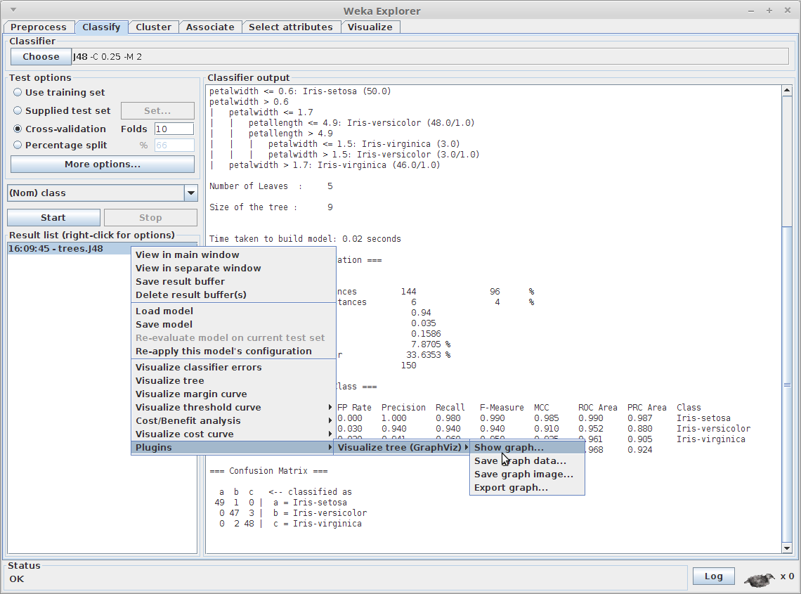
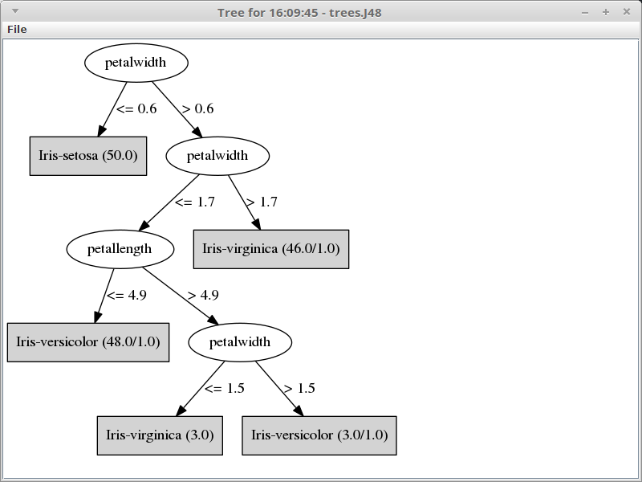
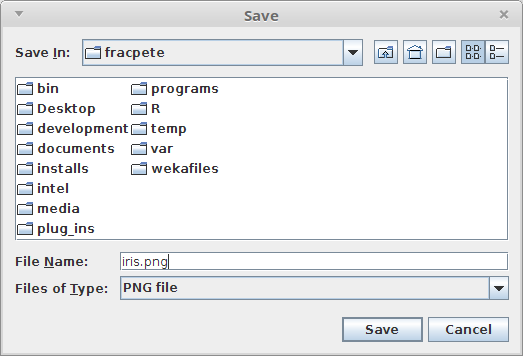
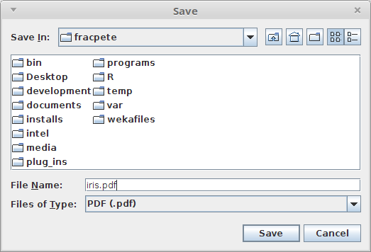

# graphviz-treevisualize-weka-package

TreeVisualize plugin for the Explorer using GraphViz (http://www.graphviz.org/)
to generate the tree.

By default, the plugin expects the `dot` executable to be available on the
system path. If that should not be the case, you can specify the correct
location in the `GraphVizTreeVisualization.props` properties file.

Simply create the following file:

* Linux/Mac
  ```
  $HOME/wekafiles/props/GraphVizTreeVisualization.props
  ```
`
* Windows
  ```
  %USERPROFILE%\wekafiles\props\GraphVizTreeVisualization.props
  ```

And add the following content (adjust path, of course):

* Linux/Mac
  ```
  Executable=/some/where/dot
  ```

* Windows
  ```
  Executable=C:/Progam Files/some/where/dot.exe
  ```

Additional options for the executable can be specified with the
`AdditionalOptions` property in the same properties file.


## GraphVizTreeVisualization.props

Explanation of parameters:

* `Executable` -- the path to the executable, if not on the system path 
* `AdditionalOptions` -- additional options to use, like output format
* `ImageExtension` -- the image extension to use
* `Debug` -- whether to output debugging information
* `CleanUpTempFiles` -- whether to clean up temporary files
* `DialogWidth` -- the default width of the dialog displaying the graph
* `DialogHeight` -- the default height of the dialog displaying the graph


## Releases

* 2018.5.13 ([Weka >= 3.9.1](https://github.com/fracpete/graphviz-treevisualize-weka-package/releases/download/v2018.5.13/graphviz-treevisualize-2018.5.13-3.9.x.zip), [Weka >= 3.8.1](https://github.com/fracpete/graphviz-treevisualize-weka-package/releases/download/v2018.5.13/graphviz-treevisualize-2018.5.13-3.8.x.zip))
* [2017.3.3](https://github.com/fracpete/graphviz-treevisualize-weka-package/releases/download/v2017.3.3/graphviz-treevisualize-2017.3.3.zip) (Weka >= 3.9.1)
* [2014.8.1](https://github.com/fracpete/graphviz-treevisualize-weka-package/releases/download/v2014.8.1/graphviz-treevisualize-2014.8.1.zip) (Weka >= 3.7.11 and < 3.8.1 and < 3.9.1)

### Troubleshooting

You can use the *2014.8.1* release with Weka 3.8.1 or 3.9.1, but you need to 
create the `GraphVizTreeVisualization.props` properties file in the location
explained above and add the following parameter to it (you may also have to
add the `Executable` parameter):

```
AdditionalOptions=-Tpng
```

The new class loading mechanism in these Weka releases prevents the properties
file from being loaded and graphviz not getting an output type parameter in
its command-line, resulting in outputting the graph data again (which of course
will fail to load as an image, see issue [#3](https://github.com/fracpete/graphviz-treevisualize-weka-package/issues/3)).

## How to use packages

For more information on how to install the package, see:

https://waikato.github.io/weka-wiki/packages/manager/


## Maven

Add the following dependency in your `pom.xml` to include the package:

```xml
    <dependency>
      <groupId>com.github.fracpete</groupId>
      <artifactId>graphviz-treevisualize-weka-package</artifactId>
      <version>2018.5.13</version>
      <type>jar</type>
      <exclusions>
        <exclusion>
          <groupId>nz.ac.waikato.cms.weka</groupId>
          <artifactId>weka-dev</artifactId>
        </exclusion>
      </exclusions>
    </dependency>
```

## Screenshots

### Plugin menu



### Show graph

For the displaying the graph as an image:



### Save graph data

Allows you to save the graph as `.dot` text file:


### Save graph image

Allows you to save the graph as PNG image:



### Export graph

Here you can export the graph as PDF, Postscript or encapsulated Postscript:


